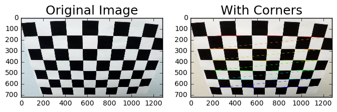
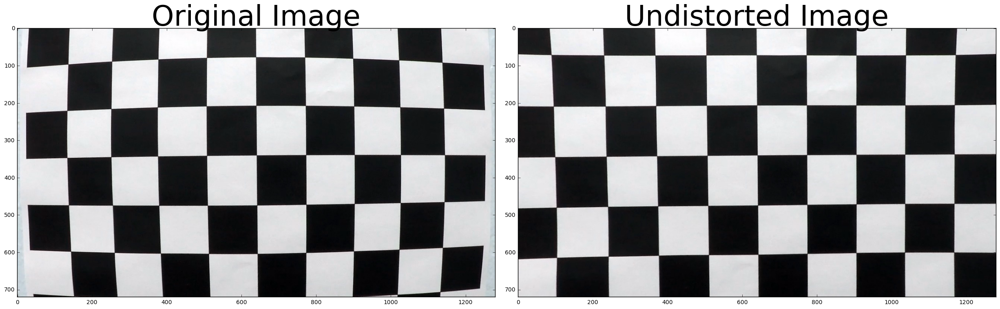
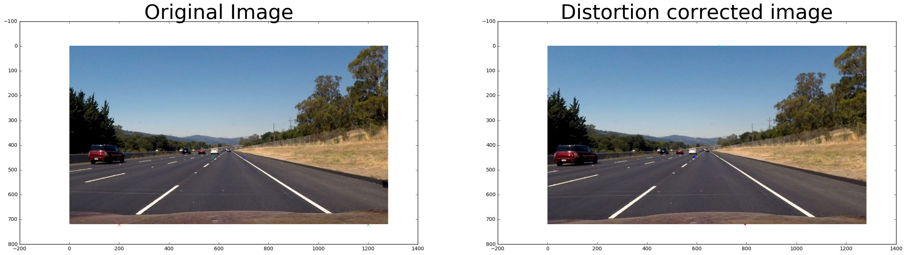
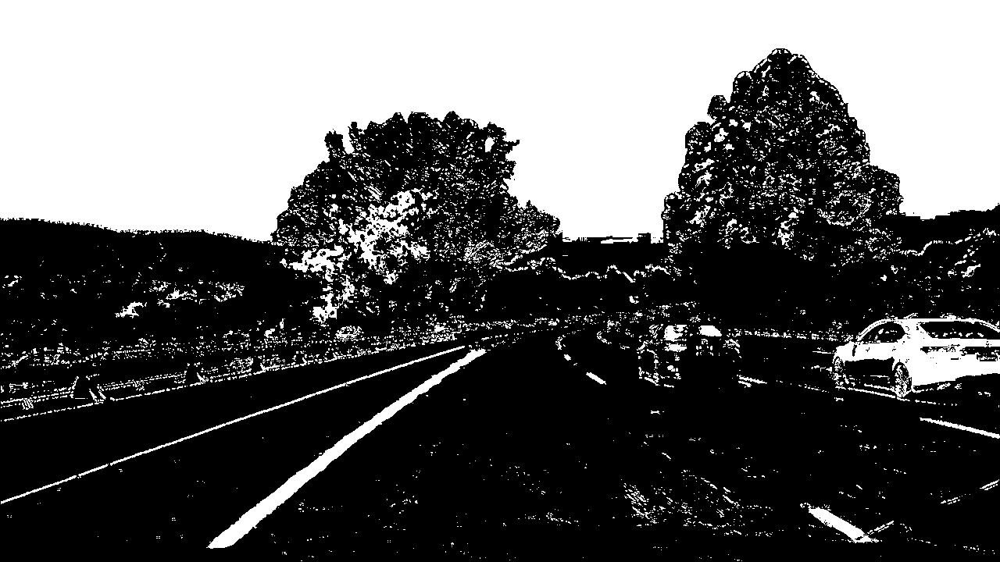
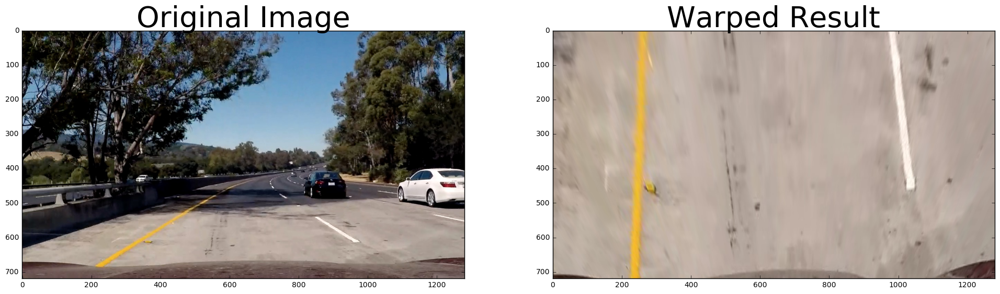
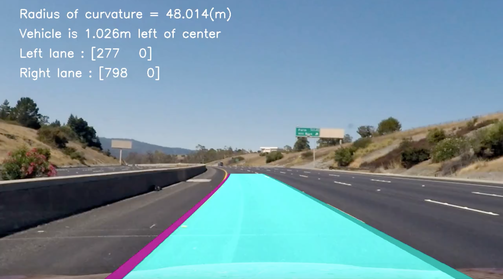

# Advanced Lane Finding
### Udacity Self-Driving Car Nanodegree - Project 4 
[](http://www.udacity.com/drive)

---
**Advanced Lane Finding Project**

The goals / steps of this project are the following:

* Compute the camera calibration matrix and distortion coefficients given a set of chessboard images.
* Apply a distortion correction to raw images.
* Use color transforms, gradients, etc., to create a thresholded binary image.
* Apply a perspective transform to rectify binary image ("birds-eye view").
* Detect lane pixels and fit to find the lane boundary.
* Determine the curvature of the lane and vehicle position with respect to center.
* Warp the detected lane boundaries back onto the original image.
* Output visual display of the lane boundaries and numerical estimation of lane curvature and vehicle position.

# Rubric Discussion
---

## Camera Callibration

#### Briefly state how you computed the camera matrix and distortion coefficients. Provide an example of a distortion corrected calibration image.

* Compute the camera calibration matrix and distortion coefficients given a set of chessboard images.
    * Camera callibration

        This code was taken from the lesson on stage 9 <strong>"Finding Corners"</strong>

    ````
    # Calibrate Camera
    # Draw lines on the chessboard, taken from slide 9. Finding Corners from the lesson.
    objpoints = [] # 3d points in real world space.  Should all be the same. (See 10 - Calibrating Camera)
    imgpoints = [] # 2d points in image plane.

    objp = np.zeros((6*9,3), np.float32) # Needs to be 9, not 8 like in the video.
    objp[:,:2] = np.mgrid[0:9, 0:6].T.reshape(-1,2)

    # Glob api reads in all the images, must have consistant file name.
    images = glob.glob('camera_cal/calibration*.jpg')

    # Loop through each calibration image
    for image, fname in enumerate(images):
        
        img = cv2.imread(fname)
        gray = grayscale(img)

        # Find the chessboard corners.  This allows us to get coordinates of corners on distorted image.
        ret, corners = cv2.findChessboardCorners(gray, (9,6), None)

        # If found, add object points and image points
        if ret == True:
            objpoints.append(objp)
            imgpoints.append(corners)

            # Draw and display the corners
            cv2.drawChessboardCorners(img, (9,6), corners, ret)
            
            f, (ax1, ax2) = plt.subplots(1, 2, figsize=(8,4))
            ax1.imshow(cv2.cvtColor(mpimg.imread(fname), cv2.COLOR_BGR2RGB))
            ax1.set_title('Original Image', fontsize=18)
            ax2.imshow(cv2.cvtColor(img, cv2.COLOR_BGR2RGB))
            ax2.set_title('With Corners', fontsize=18)
    ````
    Produces the undistorted image below.

<p align="center"></p>

* Apply a distortion correction to raw images.
    * Distortion correction 

        This code comes from stage 11 <strong>"Correcting for Distortion"</strong>

    ````

    # Loop through and display each undistorted image.
    for image, fname in enumerate(images):
        
        img = cv2.imread(fname)
        
        undistorted = cal_undistort(img, objpoints, imgpoints)

        f, (ax1, ax2) = plt.subplots(1, 2, figsize=(24, 9))
        f.tight_layout()
        ax1.imshow(img)
        ax1.set_title('Original Image', fontsize=50)
        ax2.imshow(undistorted)
        ax2.set_title('Undistorted Image', fontsize=50)
        plt.subplots_adjust(left=0., right=1, top=0.9, bottom=0.)

    ````

### 1. Provide an example of a distortion-corrected image.

Below is an example of a distorted image and undistorted image side by side.

<p align="center"></p>

## Pipeline (Images)
---

This section will discuss distortion correction, color transforms, gradients, perspective transform, identifying lane lines, calculating radius curavature.

#### Provide an example of a distortion-corrected image.

The image below is an example image with the distortion corrected.

<p align="center"></p>

### 2. Describe how (and identify where in your code) you used color transforms, gradients or other methods to create a thresholded binary image. Provide an example of a binary image result.

* Use color transforms, gradients, etc., to create a thresholded binary image.

    * Color transforms

        * Sobel.  

        Taken from stage 21. <strong>"Applying Sobel"</strong>.


        ````

        def abs_sobel_thresh(gray, orient='x', sobel_kernel=3, thresh=(0, 255)):
            
            # Apply x or y gradient
            if orient == 'x':
                sobel = cv2.Sobel(gray, cv2.CV_64F, 1, 0, ksize=sobel_kernel)
            elif orient == 'y':
                sobel = cv2.Sobel(gray, cv2.CV_64F, 0, 1, ksize=sobel_kernel)
                
            # Take the absolute values
            sobel = np.absolute(sobel)
            
            # Rescale back to 8 bit integer
            scaled_sobel = np.uint8(255*sobel/np.max(sobel))
            
            # Create a copy and apply the threshold
            binary_output = np.zeros_like(scaled_sobel)
            binary_output[(scaled_sobel > thresh[0]) & (scaled_sobel < thresh[1])] = 1
            
            # Return the result
            return binary_output

        ````

    * Gradient

        * Magnitude of the gradient.

        Taken from stage 22, <strong>"Magnitude of the Gradient"</strong>.


        ````

        def mag_thresh(gray, sobel_kernel=3, mag_thresh=(0, 255)):
            
            # 1) Already converted to Grayscale
            
            # 2) Take both Sobel x and y gradients
            sobelx = cv2.Sobel(gray, cv2.CV_64F, 1, 0, ksize=sobel_kernel)
            sobely = cv2.Sobel(gray, cv2.CV_64F, 0, 1, ksize=sobel_kernel)
            
            # 3) Calculate the gradient magnitude
            gradmag = np.sqrt(sobelx ** 2 + sobely ** 2)
            
            # 4) Rescale to 8 bit 
            scale_factor = np.max(gradmag)/255 
            gradmag = (gradmag/scale_factor).astype(np.uint8) 
            
            # 5) Create a binary image of ones where threshold is met, zeros otherwise
            binary_output = np.zeros_like(scaled_sobel)
            binary_output[(scaled_sobel > mag_thresh[0]) & (scaled_sobel < mag_thresh[1])] = 1

            return binary_output

        ````
<p align="center"></p>

        * Direction of the gradient

        Taken from stage 23, <strong>"Direction of the Gradient"</strong>.
        

        ````
        # Calculate gradient direction
        ### Code taken from stage 23, "Direction of the Gradient"
        def dir_threshold(image, sobel_kernel=3, thresh=(0, np.pi/2)):
            
            # 1 grayscale image
            gray = grayscale(image)
            
            # 2) Take the gradient in x and y separately
            sobelx = cv2.Sobel(gray, cv2.CV_64F, 1, 0, ksize=sobel_kernel)
            sobely = cv2.Sobel(gray, cv2.CV_64F, 0, 1, ksize=sobel_kernel)
            
            # 3) Error statement to ignore division and invalid errors
            direction = np.arctan(np.absolute(sobely),np.absolute(sobelx))
            binary_output =  np.zeros_like(direction)
            binary_output[(direction >= thresh[0]) & (direction <= thresh[1])] = 1
            plt.imshow(binary_output)
            # Return the result
            return binary_output
        ````


* Apply a perspective transform to rectify binary image ("birds-eye view").
    * Perspective transform

    This code comes from stage 17, <strong>"Undistort and Transform"</strong>

    ````
    ...

    def warp(img):
        img_size = (img.shape[1], img.shape[0])
        src = np.float32([ [700,450],[1200,720],[200,720],[575,450] ])
        dst = np.float32([ [1000,0],[1200,720],[400,720],[400,0] ])
        
        M = cv2.getPerspectiveTransform(src, dst)
        
        warped = cv2.warpPerspective(img, M, img_size, flags=cv2.INTER_LINEAR)

        return warped

    ...

    t_image = mpimg.imread('test_images/test5.jpg')

    w_image = warp(t_image)

    p, (ax1, ax2) = plt.subplots(1, 2, figsize=(24, 9))

    ax1.set_title('Original Image', fontsize=40)
    ax1.imshow(t_image)

    ax2.set_title('Warped Result', fontsize=40)
    ax2.imshow(w_image)

    ````

###3. Describe how (and identify where in your code) you performed a perspective transform and provide an example of a transformed image.

Produces the warped image below.

<p align="center"></p>


## Pipeline (Video)

###5. Describe how (and identify where in your code) you calculated the radius of curvature of the lane and the position of the vehicle with respect to center.

* Determine the curvature of the lane and vehicle position with respect to center.
    * Curvature, Vehicle position
        ````
        ....

        curve_centers = Tracker(Mywindow_width = window_width, Mywindow_height = window_height, Mymargin = 25, My_ym = 10/720, My_xm = 4/384, Mysmooth_factor = 15)

        ....
        ````
        Calls the tracker class, this class was built in the Walk through video and the code is taken from there. This returns the position of the car in the image.
        ````
        class Tracker():
            def __init__(self, Mywindow_width, Mywindow_height, Mymargin, My_ym = 1, My_xm = 1, Mysmooth_factor = 15):
                
                self.recent_centers = []
                self.window_width = Mywindow_width
                self.window_height = Mywindow_height
                self.margin = Mymargin
                self.ym_per_pix = My_ym
                self.xm_per_pix = My_xm
                self.smooth_factor = Mysmooth_factor
                
            def find_window_centroids(self, warped):
                
                window_width = self.window_width
                window_height = self.window_height
                margin = self.margin
                
                # Storing [left,right] pairs
                window_centroids = []
                window = np.ones(window_width)
                
                l_sum = np.sum(warped[int(3 * warped.shape[0] / 4):,:int(warped.shape[1] / 2)], axis=0)
                l_center = np.argmax(np.convolve(window,l_sum)) - window_width / 2
                
                r_sum = np.sum(warped[int(3 * warped.shape[0] / 4):,int(warped.shape[1] / 2):], axis=0)
                r_center = np.argmax(np.convolve(window,r_sum)) - window_width / 2 + int(warped.shape[1] / 2)
                
                window_centroids.append((l_center, r_center))
                
                for level in range(1,(int)(warped.shape[0]/window_height)):
                   
                    image_layer =  np.sum(warped[int(warped.shape[0] - (level + 1) * window_height):int(warped.shape[0] - level * window_height),:], axis=0)
                    conv_signal = np.convolve(window, image_layer)
                    
                    offset = window_width / 2
                    
                    l_min_index = int(max(l_center + offset - margin, 0))
                    l_max_index = int(min(l_center + offset + margin, warped.shape[1]))
                    l_center = np.argmax(conv_signal[l_min_index:l_max_index]) + l_min_index - offset
                    
                    r_min_index = int(max(r_center + offset - margin, 0))
                    r_max_index = int(min(r_center + offset + margin, warped.shape[1]))
                    r_center = np.argmax(conv_signal[r_min_index:r_max_index]) + r_min_index - offset
                    
                    window_centroids.append((l_center,r_center))
                    
                self.recent_centers.append(window_centroids)
                
                return np.average(self.recent_centers[-self.smooth_factor:], axis=0)
                
        print("Tracker class is defined")
        ````
* Fit the detected lane boundaries back onto the original image.

This code was taken from the walk through video.  It creates and array of left and right lane values taken from the warped image.
````
....

warped = cv2.warpPerspective(preprocessImage, M, image_size, flags=cv2.INTER_LINEAR)

....
````

````
...
    yvals = range(0,warped.shape[0])

    res_yvals = np.arange(warped.shape[0]-(window_height / 2),0,-window_height)
    
    left_fit = np.polyfit(res_yvals, leftx, 2)
    left_fitx = left_fit[0] * yvals * yvals + left_fit[1] * yvals + left_fit[2]
    left_fitx = np.array(left_fitx, np.int32)
    
    right_fit = np.polyfit(res_yvals, rightx, 2)
    right_fitx = right_fit[0] * yvals * yvals + right_fit[1] * yvals + right_fit[2]
    right_fitx = np.array(right_fitx, np.int32)
    
    left_lane = np.array(list(zip(np.concatenate((left_fitx - window_width / 2, left_fitx[::-1] + window_width / 2), axis=0), np.concatenate((yvals,yvals[::-1]),axis=0))),np.int32)
    right_lane = np.array(list(zip(np.concatenate((right_fitx - window_width / 2, right_fitx[::-1] + window_width / 2), axis=0), np.concatenate((yvals,yvals[::-1]),axis=0))),np.int32)
    middle_marker = np.array(list(zip(np.concatenate((right_fitx - window_width / 2, right_fitx[::-1] + window_width / 2), axis=0), np.concatenate((yvals,yvals[::-1]),axis=0))),np.int32)
    
    road = np.zeros_like(img)
    road_bkg = np.zeros_like(img)
    
    cv2.fillPoly(road,[left_lane],color=[0,255,0])
    cv2.fillPoly(road,[right_lane],color=[255,0,255])
...
````

* Output visual display of the lane boundaries and numerical estimation of lane curvature and vehicle position.
    * Generate numerical estimates
        * Lane curvature, Vehicle position

        ### 4. Describe how (and identify where in your code) you identified lane-line pixels and fit their positions with a polynomial?

        The code below takes the values returned from the Tracker class and draws the lane lines.
        ````
        ...

        res_yvals = np.arange(warped.shape[0]-(window_height / 2),0,-window_height)
        
        left_fit = np.polyfit(res_yvals, leftx, 2)
        left_fitx = left_fit[0] * yvals * yvals + left_fit[1] * yvals + left_fit[2]
        left_fitx = np.array(left_fitx, np.int32)
        
        right_fit = np.polyfit(res_yvals, rightx, 2)
        right_fitx = right_fit[0] * yvals * yvals + right_fit[1] * yvals + right_fit[2]
        right_fitx = np.array(right_fitx, np.int32)
        
        left_lane = np.array(list(zip(np.concatenate((left_fitx - window_width / 2, left_fitx[::-1] + window_width / 2), axis=0), np.concatenate((yvals,yvals[::-1]),axis=0))),np.int32)
        right_lane = np.array(list(zip(np.concatenate((right_fitx - window_width / 2, right_fitx[::-1] + window_width / 2), axis=0), np.concatenate((yvals,yvals[::-1]),axis=0))),np.int32)
        middle_marker = np.array(list(zip(np.concatenate((right_fitx - window_width / 2, right_fitx[::-1] + window_width / 2), axis=0), np.concatenate((yvals,yvals[::-1]),axis=0))),np.int32)
        
        road = np.zeros_like(img)
        road_bkg = np.zeros_like(img)
        
        cv2.fillPoly(road,[left_lane],color=[0,255,0])
        cv2.fillPoly(road,[right_lane],color=[255,0,255])
        cv2.fillPoly(road_bkg,[left_lane],color=[255,255,255])
        cv2.fillPoly(road_bkg,[right_lane],color=[255,255,255])

        ...
        ````

####6. Provide an example image of your result plotted back down onto the road such that the lane area is identified clearly.

<p align="center"></p>

### Video
---

You can watch the video of the result on the project.mp4 video [here](https://www.youtube.com/watch?v=QGtB2jtJM_Q). 


## Project Discussion
---

The biggest area where I noticed this failing is during sharp turns.  The hardest cahllenge video really highlight this for me.  I did not have time to address this and get the project in on time however my initial idea sto solve that issue are:
* Take a smaller area of interest.  Or, even better, have a dynamically shifting area of interest that somehow is optimized to adjust to road curvatures that shorten up the lane lines.
    I think one of the biggest issues is that I am creating an area of interest that just simply will not work if the road curves too sharply.  By creating a shallower area of interest I can focus on grabing the lane lines that are still detected by not get thrown off when the road ends and my algorithm is still searching for lane line pixels.
* This algorithm also fails when the light changes. 
    Creating a pipline that can adjust and perhaps "try" a few different approaches of an optimal result is not returned would be ideal.  I think knowing what optimal means in this case would be a huge challenge.  I think developing a pipeline that assumes to know what the correct lane data is at any point would be the incorrect approach so how to make a pipeline that can adjust but still rely only on data to influence it's desicion will be a challenge.

